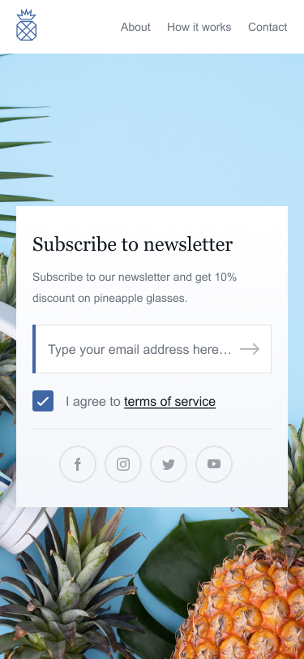

# Simple React newsletter subscription page
Newsletter subscription page for an imaginary company 'pineapple'. The layout is responsive, contains many hover effects, and input fields are validating for: 
* Empty e-mail field
* Incorrectly filled e-mail field
* E-mails that are ending with '.co'
* Agreement to terms of service

After submitting a correctly filled form, page turns to a 'success' layout.

### Desktop screenshot

### Mobile screenshot

### Running the project locally
1. `git clone`
2. `npm install`
3. `npm start`